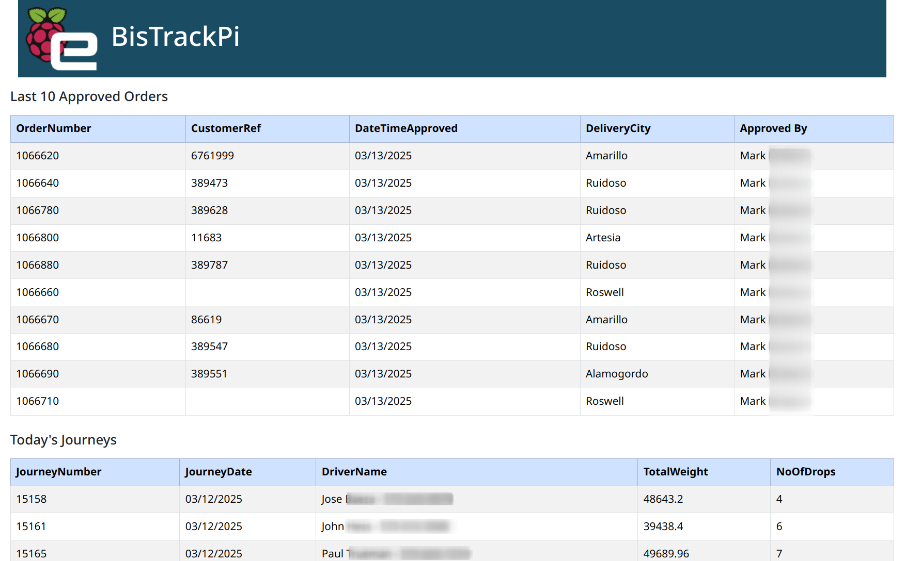

<a id="readme-top"></a>

<a href="https://github.com/rhp997/BTPi">
    
</a>
<br /><br />

# BisTrack Pi (BTPi)

<!-- ABOUT THE PROJECT -->

## About

This project provides a mechanism for querying data from a Microsoft SQL Server (MSSQL) database and making that data available and formatted in a browser with a configurable data refresh rate. Specifically, the app is intended to communicate with Epicor's BisTrack software with the server running on a Raspberry Pi device, but any MSSQL database and/or device capable of running a Node.js app will suffice. The Raspberry Pi will act as the (Express) server and client (chromium-browser).

### Server (Raspberry Pi)

- The service app.js listens on a (configurable) port
  - The winston module creates error and info logs and rotates daily (14 days kept)
  - On initialization, the service reads a list of (configurable) queries and runs each.
  - Each enabled query is also added to a schedule (node-schedule) and executed with the output saved as a JSON file at the scheduled interval
  - A list of successful queries (name, title, & filepath only) is written to /public/data/queryList.json for JQuery access
  - POST to /data will run all enabled queries and set the 'Last-Modified' header in the return to the timestamp
- The public folder is published as the HTML root and index.html served to the user by default
- Query results are written to /public/data as JSON files (consumed by AJAX in index.html)
- PM2 manages the server process and automatically starts on reboot

### Client (Raspberry Pi)

- Default chromium-browser is used to launch index.html in kiosk mode
- index.html utilizes a META refresh to automatically refresh (separate from node-schedule)
- By default, index.html contains two tables (formatted with Bootstrap) named Table1 and Table2 corresponding to the number of default queries
  - If you have more queries, simply copy/paste one of the tables and change the number on the end of the ID (e.g. Table3)
  - Table columns and rows are dynamically derived from the output of the passed query.
  - The table header is derived from the configured query's title attribute
  - A text value indicates the last time the page was reloaded by the META tag (not file timestamp)
- Using JQuery and a text editor, the format of the webpage is easily changed
  - Instead of tablular data, consider widgest from Charts.js or similar

<p align="right">(<a href="#readme-top">back to top</a>)</p>

## Built With

[![RPi][rpi]][rpi-url]
[![Next][Next.js]][Next-url]
[![Bootstrap][Bootstrap.com]][Bootstrap-url]
[![JQuery][JQuery.com]][JQuery-url]
[![Javascript][Javascript]][Javascript-url]
[![PM2][pm2]][pm2-url]

<p align="right">(<a href="#readme-top">back to top</a>)</p>

## Prerequisites

- A Raspberry Pi (RPi) with a working OS and GUI. Examples will assume Raspberry Pi OS (bookworm).
- Access to the RPi's command line with administrator/sudo privileges

## Basic RPi Config

1. Update Locale, Timezone, and Keyboard to match your environment. The scheduler and logs will utilize these values. Note the RPi defaults are UK-based. (Preferences --> Raspberry Pi Configuration --> Localisation)
2. Configure chromium not to ask about restoring the last session if improperly closed. Enter the following in a terminal:

   ```sh
   sed -i 's/"exited_cleanly":false/"exited_cleanly":true/' "$HOME/.config/chromium/Default/Preferences"
   sed -i 's/"exit_type":"Crashed"/"exit_type":"Normal"/' "$HOME/.config/chromium/Default/Preferences"
   ```

3. _Optional_: Enable SSH and VNC (Preferences --> Interfaces) and configure remote access. See VNC Notes below.
4. _Optional_: Disable notice for launching executable (e.g., \*.desktop) files

   - Open a file manager window and navigate to Edit --> Preferences --> General
   - Check box "Don't ask options on launch executable file"

   ### VNC Configuration Notes

   Note: Recent versions of Raspberry OS uses Wayland VNC (wayvnc) by default. Encryption is not fully implemented and unnecessarily takes up resources on a local network. If not needed or a "No matching security types" connection error is encountered, disable with:

   ```sh
   sudo nano /etc/wayvnc/config
   ```

   Set:
   enable_auth=false

   Reboot (wayvncctl doesn't seem to work?)

<p align="right">(<a href="#readme-top">back to top</a>)</p>

## Node.js Environment

Configure RPi to run Node.js by installing through nvm (avoid the repository version from apt). In a terminal:

```sh
sudo apt update && curl -o- https://raw.githubusercontent.com/nvm-sh/nvm/v0.40.0/install.sh | bash
```

Reload the terminal shell and check version to verify install:

```sh
source ~/.bashrc
nvm --version
```

List the versions available and find a Long-Term-Support (LTS) version to install:

```sh
nvm ls-remote
```

Install the chosen version by copying or typing in the version number. I chose the latest LTS version v22.13.1. Your options may vary:

```sh
nvm install v22.13.1
```

Set to use this version:

```sh
nvm use v22.13.1
```

<p align="right">(<a href="#readme-top">back to top</a>)</p>

## Configure Server

Create the server path, temporarily open permissions to facilitate module installation and repo copy, clone the BTPi repository, and install the required modules:

```sh
sudo mkdir /srv/BTPi && sudo chmod 777 /srv/BTPi
git clone https://github.com/rhp997/BTPi.git /srv/BTPi
```

Download the required modules inside the /srv/BTPi directory:

```sh
cd /srv/BTPi
npm init -y
npm install express mssql winston winston-daily-rotate-file winston moment-timezone node-schedule
```

_Optional:_ Install pm2 (globally) to manage the process:

```sh
npm install pm2@latest -g
```

### Modify Config Files

1. /config/config.json: Copy the example file (config-EXAMPLE.json) and rename config.json. Edit config.json:
   - **database:** Enter the database credentials for your environment. At a minimum, the user, password, server, and database keys need to be changed.
   - **server:** Optionally, the port the server will listen on may be changed here. If changed, make note of the port as it will also need to be updated elsewhere.
   - **schedule:** Enter a schedule to automatically run the queries. Use crontab format (see also https://crontab.guru/)
2. /config/queries.json: Copy the example queries file (queries-EXAMPLE.json) and rename queries.json. Edit queries.json:
   - **Name:** Unique name identifying the query
   - **Title:** Title used for the table
   - **SQL:** SQL to execute
   - **File:** Location of the output file. Should be in public/data/
   - **Enabled:** true to enable, false to disable

Save the new config files.
While inside the main /srv/BTPi directory, run the server with:

```sh
node app.js
```

If everything worked, you should see a message stating the server has started and is listening on the configured port. Additionally, if queries were specified in queries.json, they will attempt to run on server initialization and the resultant /public/data/\*.json files should be created.

Finally, change permissions on the folder back to the defaults:

```sh
sudo chmod 755 /srv/BTPi
```

<p align="right">(<a href="#readme-top">back to top</a>)</p>

## Autostart Browser

To start the browser in kiosk mode on reboot, locate the rpi-config/BTPI.desktop file and edit with a text editor to use the configured port. Save the .desktop file and copy it to the autostart directory:

```sh
mkdir -p ~/.config/autostart
cp /srv/BTPi/rpi-config/BTPi.desktop ~/.config/autostart && sudo chmod +x ~/.config/autostart/BTPi.desktop
```

_Optional:_ Copy the launcher to the Desktop:

```sh
cp /srv/BTPi/rpi-config/BTPi.desktop ~/Desktop && sudo chmod +x ~/Desktop/BTPi.desktop
```

Note the BTPi.desktop file intended for the autostart directory includes a sleep command to wait a few seconds before launching. This gives the RPi time to start the network and PM2 process. If copying to ~/Desktop, the sleep delay can be removed from the ~/Desktop copy.

Double click the launcher to test.

<p align="right">(<a href="#readme-top">back to top</a>)</p>

## Optional: Daemonize the Server (PM2)

PM2 is a daemon process manager that keeps the application running and automatically started following a reboot.
With the server (node app.js) running in the background, change to the server directory and run the following:

```sh
cd /srv/BTPi
pm2 startup
```

Copy the text created by the startup command and run it in a terminal by pasting. Verify the command completed succesfully. Next, save the process list for reboot persistence:

```sh
pm2 save
```

Test by rebooting (sudo reboot) and checking for the running process with:

```sh
ps -ax | grep app.js
```

### PM2 Notes

View running processes:

```sh
pm2 ls
```

View information on app.js:

```sh
pm2 show app
```

Stop the process:

```sh
pm2 stop app
```

Start the process:

```sh
pm2 start app
```

<p align="right">(<a href="#readme-top">back to top</a>)</p>

<!-- MARKDOWN LINKS & IMAGES -->

[Next.js]: https://img.shields.io/badge/next.js-000000?style=for-the-badge&logo=nextdotjs&logoColor=white
[Next-url]: https://nextjs.org/
[Bootstrap.com]: https://img.shields.io/badge/Bootstrap-563D7C?style=for-the-badge&logo=bootstrap&logoColor=white
[Bootstrap-url]: https://getbootstrap.com
[JQuery.com]: https://img.shields.io/badge/jQuery-0769AD?style=for-the-badge&logo=jquery&logoColor=white
[JQuery-url]: https://jquery.com
[Javascript]: https://img.shields.io/badge/javascript-F7DF1E?style=for-the-badge&logo=javascript&logoColor=black
[Javascript-url]: https://www.javascript.com/
[pm2]: https://img.shields.io/badge/pm2-2B037A?style=for-the-badge&logo=pm2&logoColor=white
[pm2-url]: https://pm2.keymetrics.io/
[rpi]: https://img.shields.io/badge/raspberrypi-A22846?style=for-the-badge&logo=raspberrypi&logoColor=white
[rpi-url]: https://www.raspberrypi.com/
