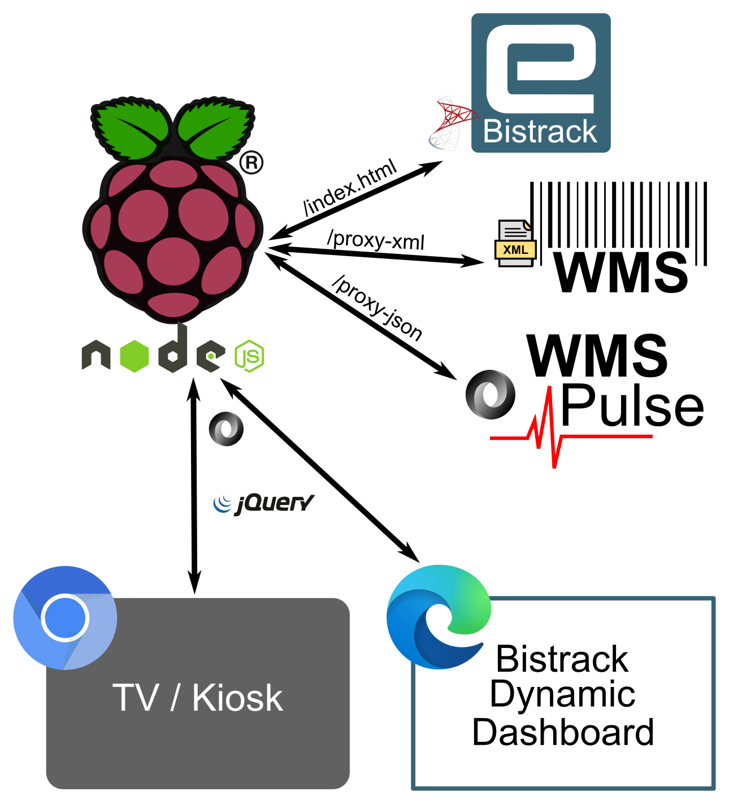
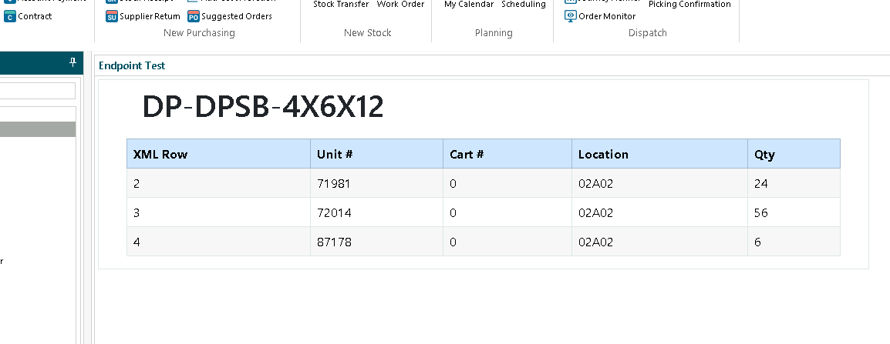

<a id="readme-top"></a>

<br /><br />

# BisTrack Pi (BTPi)

## Built With

[![RPi][rpi]][rpi-url]
[![Node][Node.js]][Node-url]
[![Express][Express]][Express-url]
[![Bootstrap][Bootstrap.com]][Bootstrap-url]
[![JQuery][JQuery.com]][JQuery-url]
[![Javascript][Javascript]][Javascript-url]
[![PM2][pm2]][pm2-url]
[![Axios][Axios]][Axios-url]

## About

This project creates a Node.js server on Raspberry Pi (RPi) hardware with the intent of unifying three distinct areas of Epicor's Bistrack and Warehouse Management System (WMS) for Business Intelligence (BI) development. In short, BTPi provides a mechanism for developing BisTrack BI on Pi. The RPi platform was chosen for its diminuitive size, relatively low cost, well-supported OS, and ability to connect to a TV or monitor via an HDMI port. However, any architecture that supports Node.js (e.g., a Node container) could be substituted.

<a href="public/images/overview.png">

</a>

## Bistrack Access

Epicor’s Bistrack application utilizes a Microsoft SQL Server (MSSQL) back-end that BTPi accesses via the "mssql" Node package. Once configured, BTPi connects to the Bistrack database and executes all defined queries on a configurable interval (crontab-style). Query results are saved as JSON files for client-side scripting access.

An example queries.json config file:

```
{
  "queries": [
    {
      "Name": "LastApproved",
      "Title": "Last 10 Approved Orders",
      "SQL": "SELECT TOP 10 oh.OrderNumber [Order #], oh.CustomerRef [Reference], oh.DateTimeApproved [Approved On] FROM OrderHeader oh INNER JOIN Users u ON u.UserID = oh.ApprovedByID ORDER BY 3 DESC",
      "File": "public/data/approvedorders.json",
      "Enabled": true
    }
  ]
}
```

### Data Routes

The /data route allows all queries to be run at once (POST) or individually by query Name (GET) depending on the HTTP method invoked.

The POST invocation was intended for use with a "Submit" button to refresh all the data and will create JSON files for each enabled query while also setting the 'Last-Modified' header in the response to the current timestamp.

Calling the /data route using GET allows individual queries (must be enabled in Queries.json) to be called ad-hoc using the appropriate "Name" parameter. The response is returned in JSON. A client-side example is shown below:

```
$.ajax({
  // The data route expects a query name to be passed in the "Name" parameter.
  url: "/data",
  data: {
    Name: "LastApproved",
  },
  cache: false,
  dataType: "json",
  contentType: "application/json; charset=utf-8",
  method: "GET",
  success: function (data) {
    if (data) {
      ...
    } else {
      console.log("No data returned from the server.");
    }
  },
  error: function (error) {
    console.error(error);
  },
});
```

### Landing Page and RPi

BTPi access to the Bistrack database was intended to support BI displayed on a large TV or monitor for non-interactive viewing. The default landing page is index.html which displays query results in a tabular format:

<a href="public/images/screenshot.png">
    
</a>
<br /><br />
When accessing Bistrack data, the RPi serves as both the server and client.

#### Server (app.js)

- The service app.js listens on a (configurable) port
  - The winston module creates error and info logs and rotates daily (14 days kept)
  - On initialization, the service reads a list of (configurable) queries and runs each.
  - Each enabled query is also added to a global schedule (node-schedule) and executed with the output saved as a JSON file
  - A list of successful queries (name, title, & filepath only) is written to /public/data/queryList.json for JQuery access
  - POST to /data will run all enabled queries and set the 'Last-Modified' header in the return to the timestamp
  - GET to /data with a corresponding "Name" parameter will run the specified query (must be enabled) in queries.json
- The public folder is published as the HTML root and index.html served to the user by default
- Query results are written to /public/data as JSON files (consumed by AJAX in index.html)
- Optional: PM2 manages the server process and automatically starts on reboot

#### Client (chromium-browser)

- Default chromium-browser is used to launch index.html in kiosk mode (<a href="RPIConfig.md#rpi-autostart">see also ~/.config/autostart</a>)
- index.html utilizes a META refresh to automatically refresh (separate from node-schedule)
- By default, index.html contains two tables (formatted with Bootstrap) named Table1 and Table2 corresponding to the number of default queries
  - If you have more queries, simply copy/paste one of the tables and change the number on the end of the ID (e.g. Table3)
  - Table columns and rows are dynamically derived from the output of the passed query.
  - The table header is derived from the configured query's title attribute
  - A text value indicates the last time the data or page was refreshed (see Heartbeat query)
- Using JQuery and a text editor, the format of the webpage is easily changed
  - Instead of tablular data, consider widgets from Charts.js or similar
  - A "url" attribute could be added to the META refresh to point to a new page (and the new page back or to a new page) in a daisy chain. Such a configuration would cycle through multiple views (see charts.html)

<p align="right">(<a href="#readme-top">back to top</a>)</p>

## WMS Access (Proxy Routes)

Epicor's WMS system utilizes a combination of XML endpoints and a "Pulse board" application for reporting. Accessing this data programatically traditionally faced one of three hurdles:

1. The returned data is in XML format or
2. The endpoint returns "Not an ajax request"
3. The server blocks cross-origin requests

BTPi’s proxy mode addresses both issues by accepting an "api" URL parameter, which is then requested via proxy with an unrestrictive Cross-Origin Resource Sharing (CORS) policy. For JSON requests, an additional "X-Requested-With" header is also sent to mimic an AJAX call. The endpoint data is returned in a response object as JSON.

_Note:_ Configuring wms_proxy.host_pulse and/or wms_proxy.host_xmlep (see config-EXAMPLE.json) enables relative paths to be used in client side code.

Depending on the type of endpoint being consumed, two routes are provided:

1. **/proxy-xml**: The <a href="WMSEndpoints.md">various (undocumented) XML endpoints</a> were originally exposed for QlikView consumption, but contain useful data for BI developers. BTPi implements a GET method route /proxy-xml for these XML endpoints to access and convert the data to JSON. Note the JSON data path on the returned data will typically match the following pattern:

   ```
   response.rti.target[0].returnData[0].ROWSET[0].ROW[n]
   ```

   Which corresponds to the following returned XML:

   ```
   <rti xmlns="http://xml.majuredata.com/targetNS">
      <transId/>
      <status id="OK" code="0">OK</status>
      <target tokenId="InventoryBySCE">
         <status id="OK" code="0">Unit Data, By Stock Code</status>
         <returnData>
            <ROWSET>
               <ROW num="1">
               ...
               </ROW>
            </ROWSET>
         <returnData>
      <target>
   </rti>
   ```

2. **/proxy-json**: Separately, Pulse Queries created in the WMS “Web UI” (More --> Pulse --> Pulse Query Entry) can be accessed using the /proxy-json GET route. This route bypasses the Cross-Origin Resource Sharing (CORS) policy and returns a JSON response object.

### Examples

Both WMS proxy routes (/proxy-xml and /proxy-json) can be accessed from a Dynamic Dashboard within BisTrack (e.g., fetch/JQuery).

#### XML (/proxy-xml)

The following example shows the results of a call to the InventoryBySCE (/proxy-xml) for a selected product from within a Dynamic Dashboard:

<a href="public/images/wms-product-bt.png">
    
</a>

The above example was generated with the following client-side JavaScript:

```sh
<script>
  $(document).ready(function () {
    $.ajax({
      // proxy-xml expects XML data and returns it as a JSON object
      url: "http://<BTPi-Server>:<port>/proxy-xml",
      data: {
        // If wms_proxy.host_xmlep is configured, relative paths may be used
        //api: "http://<WMS-Endpoint>:<port>/rtiWeb/run",
        api: "/rtiWeb/run",
        id: "InventoryBySCE",
        stock_code: "DP-DPSB-4x6x12",
      },
      method: "GET",
      success: function (data) {
        // Check for data and a good status code (0)
        if (
          data.rti &&
          data.rti.target[0].status[0].$.code == 0 &&
          data.rti.target[0].returnData[0].ROWSET[0].ROW
        ) {
          const row = data.rti.target[0].returnData[0].ROWSET[0].ROW;
          console.log(data.rti.target[0].returnData[0].ROWSET[0]);
          let tableHTML = "";
          $.each(row, function (i, stockCode) {
            // First row of returned XML (num = 1) is dummy data and should be skipped; use this to create the header
            if (i === 0) {
              tableHTML +=
                '<thead class="table-primary text-white"><tr><th>XML Row</th><th>Unit #</th><th>Cart #</th><th>Location</th><th>Qty</th></tr></thead><tbody>';
            } else {
              // XML Row included to demonstrate the $.num attribute
              tableHTML += `<tr><td>${stockCode.$.num}</td><td>${stockCode.UNIT_NUMBER}</td><td>${stockCode.CART_NUMBER}</td><td>${stockCode.LOCATION}</td><td>${stockCode.REMAINING_QUANTITY}</td></tr>`;
            }
          });
          tableHTML += "</tbody>";
          $("#Table1").append(tableHTML);

          $("#header").text(
            data.rti.target[0].returnData[0].ROWSET[0].ROW[1].STOCK_CODE
          );
        } else {
          console.error("Dataset empty or invalid");
          console.log(data);
        }
      },
      error: function (error) {
        console.error(error);
      },
    });
  });
</script>
```

#### JSON (/proxy-json)

Client-side code for a connection for a WMS Pulse query might resemble:

```sh
   url: "http://<BTPi-Server>:<port>/proxy-json",
   data: {
      // If wms_proxy.host_pulse is configured, use relative path /Pulse/Query/runQuery
      api: "http://<WMS-Endpoint>:<port>/Pulse/Query/runQuery",
      // The "id" parameter should match your Pulse Query
      id: "lines_shipped_last_7_days",
   },
   cache: false,
   dataType: "json",
   contentType: "application/json; charset=utf-8",
   method: "GET",
   ...
```

_Note:_ Encapsulating API parameters in the "data" section reads easier and negates the need to URL encode the parameters. If the full URL with parameters is passed without using the "data" section, be sure to encode any parameters.

<a name="server-config" id="server-config"></a>

## Server Configuration

For detailed information on installing and configuring the Node.js environment, see the <a href="RPIConfig.md#nodejs">relevant section</a> in the RPi Config page.

BTPi requires several configurable parameters and one or more queries to run.

### Configurable Parameters

Parameters may be passed to the server when started via ARGV, exported as ENV variables, or added to config/config.json. The first value found from (in order) ARGV, ENV, and config.json is used.
An example of passing parameters when starting BTPi is shown below:

```sh
node app.js --btpi.port=3004 --wms_proxy.host_xmlep="http://192.168.0.1:8710"
```

An example file (config-EXAMPLE.json) file is included with the project.

The configurable parameters consist of three JSON objects:

1. **database** - A mssql database <a href="https://tediousjs.github.io/node-mssql/">connection object</a>

   ```
   "database": {
       "user": "<databaseuser>",
       "password": "<password>",
       "server": "<database_server>",
       "database": "<database_instance>",
   }
   ```

   At a minimum, specify the BisTrack database host, instance, and user credentials. Additional connection options (pooling, encryption, timeouts, etc.) are also available.

2. **btpi** - Port and schedule interval for the btpi server

   ```
   "btpi": {
       "port": 3000,
       "interval": "*/30 8-17 * * 1-5"
   }
   ```

   BTPi will listen on the configured port and run on the scheduled interval which utilizes crontab format (see also https://crontab.guru/).

3. **wms_proxy** - Endpoint URLs when using the proxy routes

   ```
   "wms_proxy": {
       "host_pulse": "<protocol>://<server>:<port>",
       "host_xmlep": "<protocol>://<server>:<port>"
   }
   ```

   The WMS Pulse Board and QlikView endpoints (XML) can be configured here to avoid their inclusion in client side code.

_Note:_ If the btpi.port setting is changed from the default (3000), it will also need to be updated <a href="RPIConfig.md#elsewhere">in the RPi startup file</a>.

### Queries

By default, queries are specified in the config/queries.json file. Although query information can also be sent via the command line or exported to ENV variables, the queries.json file is the easiest to work with. An example file (queries-EXAMPLE.json) is provided with the project. The queries format is an array of objects with the following format:

```
{
  "queries": [
    {
      "Name": "LastApproved",
      "Title": "Last 10 Approved Orders",
      "SQL": "SELECT TOP 10 Col FROM Table",
      "File": "public/data/approvedorders.json",
      "Enabled": true
    },
    {
      "Name": "TodaysInfo",
      "Title": "Today's Information",
      "SQL": "SELECT Col2 FROM AnotherTable
      "File": "public/data/secondquery.json",
      "Enabled": false
    }
  ]
}
```

Each key is described below:

- **Name:** Unique name identifying the query
- **Title:** Title used for the query. Useful for client side titles and captions.
- **SQL:** SQL to execute
- **File:** Location of the output file (public/data/)
- **Enabled:** true to enable, false to disable

_Note:_ The Heartbeat query (see example file) returns a timestamp as the DateTimeLastRun column/property that is used by the default index.html page as a data refresh indicator

### Starting the Server

Once configuration is in place, the BTPi server may be started with:

```
node app.js
```

As noted above, configuration parameters may also be passed at startup:

```sh
node app.js --btpi.port=3004 --wms_proxy.host_xmlep="http://192.168.0.1:8710"
```

Optionally, the process can be daemonized using PM2. See the <a href="RPIConfig.md#pm2">PM2</a> section in the RPI Config for more information.

For more detailed Node.js installation and configuration instructions, see the <a href="RPIConfig.md">RPi guide.</a>

_Note:_ Changes to the config files will not take effect until the app is restarted.

<!-- MARKDOWN LINKS & IMAGES -->

[Node.js]: https://img.shields.io/badge/node.js-5FA04E?style=for-the-badge&logo=node.js&logoColor=white
[Node-url]: https://nodejs.org/en
[Express]: https://img.shields.io/badge/express-000000?style=for-the-badge&logo=express&logoColor=white
[Express-url]: https://expressjs.com/
[Bootstrap.com]: https://img.shields.io/badge/Bootstrap-563D7C?style=for-the-badge&logo=bootstrap&logoColor=white
[Bootstrap-url]: https://getbootstrap.com
[JQuery.com]: https://img.shields.io/badge/jQuery-0769AD?style=for-the-badge&logo=jquery&logoColor=white
[JQuery-url]: https://jquery.com
[Javascript]: https://img.shields.io/badge/javascript-F7DF1E?style=for-the-badge&logo=javascript&logoColor=black
[Javascript-url]: https://www.javascript.com/
[pm2]: https://img.shields.io/badge/pm2-2B037A?style=for-the-badge&logo=pm2&logoColor=white
[pm2-url]: https://pm2.keymetrics.io/
[rpi]: https://img.shields.io/badge/raspberrypi-A22846?style=for-the-badge&logo=raspberrypi&logoColor=white
[rpi-url]: https://www.raspberrypi.com/
[Axios]: https://img.shields.io/badge/axios-5A29E4?style=for-the-badge&logo=axios&logoColor=white
[Axios-url]: https://github.com/axios/axios
